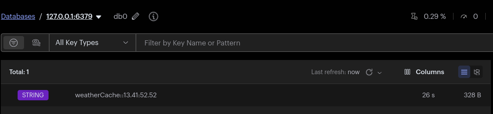
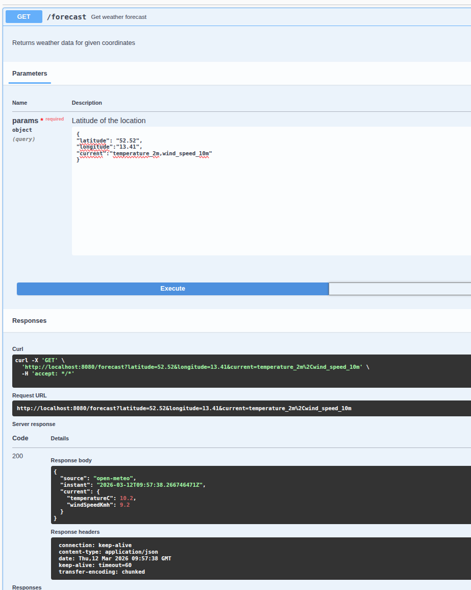

# Proxy-API


Assumptions:
---

* No security requiremensts hence no AuthN or AuthZ implemented

* Since it the API is specified and it's mean to be proxy all query parameters will be passed AS-IS to origin service. Since the only thing we know is that longitude and latitude are required and validated. Since there the expeced output is provided on the other hand it feels a bit odd since it modifies origin service output. So it's a proxy to some externd and to some not :).

What could be considered (ADRs):
---

* Spring Boot there werent any constraints there alternative approach may be, selected mainy due to all building blocks in place. 
  * No frameworks simple servlet with manuall connection handling - smaller resource footprint at a cost of maintanability and work effort (obervability etc..)
  * Some none blocking server like Netty some as above
  * Some other DI frameworks would probably be dependent on collective knowledge.


* NOT adding (NOW) Circuit breaker now since this is external system so we may not be that much concerned, unless API rate limiting is implemented on the other side.

* NOT adding (NOW) Reactive Webclient instead of RestClient if load specific justifies it. Without such information I value more maintainability, but could be swtiched if needed.

* NOT adding (NOW) Cache hierarchy Local -> Redis to increas a bit resilience if Redis get unavailable. (Skip for now)

* NOT adding (NOW) [Spring config](https://docs.spring.io/spring-cloud-config/docs/current/reference/html/) server and automatic bean reload. 

* NOT adding (NOW) any gitops ArgoCD, Flux etc...

* RateLimitng COULD be added

* Authentication COULD be added

[Swagger](http://localhost:8080/swagger-ui/index.html)


TODO:
---
* OpenTelemetry

Tutorial
---

### Local Development

Initialize a new Spring Boot Maven project:
```bash
make init-mvn
```

Build the application:
```bash
make build-java
```

Run the application locally:
```bash
make run-java
```

### Docker

Build the Docker image:
```bash
make docker-build-java
```

Run the Docker container:
```bash
make docker-run-java
```

View container logs:
```bash
make docker-logs
```

Stop the Docker container:
```bash
make docker-stop-java
```

### Security Scanning

Run Checkov security analysis on the Dockerfile:
```bash
make checkov-java
```

### Benchmarking

Run Apache Bench performance test:
```bash
make bench
```

### Kubernetes (Minikube)

Start Minikube with 4 CPUs and 8GB memory:
```bash
make minikube-start
```

Enable ingress addon:
```bash
make minikube-enable-ingress
```

Deploy the application using Helm:
```bash
make k8s-helm-install
```

Upgrade the Helm deployment:
```bash
make k8s-helm-upgrade
```

View application logs in Kubernetes:
```bash
make k8s-proxy-logs
```

Check the deployed service:
```bash
make k8s-check
```

Uninstall the Helm release:
```bash
make k8s-helm-uninstall
```

Delete the Minikube cluster:
```bash
make minikube-delete
```

Tested
---

### Redis Cache Key

* 

### OpenAPI

* 
